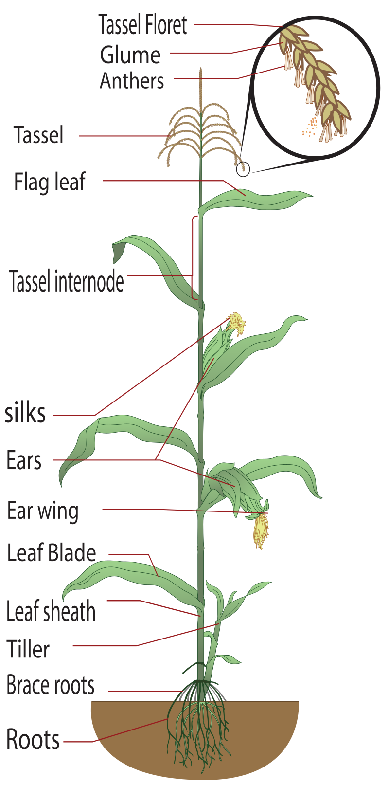

# P-Maize: A golden standard of single-cell analysis with Maize
- **Brief:** The Projection of Maize: Building a powerful analysis pipeline and Getting some significant results of maize research
- **Contributors:** chenkun1@genomics.cn; zhangzijian@genomics.cn; huangpeilin@genomics.cn; weichunxu@genomics.cn; yinzhanhao@genomics.cn; yangdong@genomics.cn
- **Log**
  - 250904 初步确定项目方案

---
# Background
- **Species**

Maize [wiki](https://en.wikipedia.org/wiki/Maize)


- **Scientific problem**
玉米苞片的发育和玉米叶的发育？


- **Reference & Citation**
  - 玉米苞叶: 2021_agriculture_Tensile Properties and Fracture Mechanisms of Corn Bract for Corn Peeling Device Design [agriculture](https://www.mdpi.com/2077-0472/11/8/796)
  - [玉米物种Wiki百科](https://en.wikipedia.org/wiki/Maize)

---
# Input
- **User:** chenkun1@genomics.cn

参考基因组数据：/Files/Chenkun/Maize_husk/reference/hzau/Zm-B73-REFERENCE-NAM-5.0.fa
基因组注释：/Files/Chenkun/Maize_husk/reference/hzau/Zm-B73-REFERENCE-NAM-5.0_Zm00001eb.1.gtf
叶片每段的下机矩阵数据（里面也有soupx矩阵）：	
/Files/Chenkun/B73_leaf/B73_L/B73_L1	
/Files/Chenkun/B73_leaf/B73_L/B73_L2	
/Files/Chenkun/B73_leaf/B73_L/B73_L3	
/Files/Chenkun/B73_leaf/B73_L/B73_L4
苞叶下机矩阵：
/Files/Chenkun/Maize_husk/maize-husk-1/
/Files/Chenkun/Maize_husk/maize-husk-2/
苞叶dataget结果：
/Files/Chenkun/Maize_husk/maize_husk_dataget/

目前项目的问题：对苞叶进行初步注释，查看光合基因在叶肉细胞和维管束鞘细胞的表达情况是否符合C3叶片
- **P-Maize**
  - Ref
    - Genome(.fa): /Files/Chenkun/Maize_husk/reference/hzau/Zm-B73-REFERENCE-NAM-5.0.fa
    - Annotation(.gtf): /Files/Chenkun/Maize_husk/reference/hzau/Zm-B73-REFERENCE-NAM-5.0_Zm00001eb.1.gtf
    - Protein(.fa): NA
  - Matrix
    - leaf
    - bract
  - Pipeline1-single (huangpeilin@genomics.cn; yangdong@genomics.cn)
  - Pipeline2-pair (yinzhanhao@genomics.cn; weichunxu@genomics.cn; zhangzijian@genomics.cn)

```shell
tree /data/input/Files/P-Maize -L 3
/data/input/Files/P-Maize
├── Matrix
│   ├── L1
│   │   ├── B73_L1_1_web_10_220610
│   │   ├── B73_L1_1_web_9_220908
│   │   ├── B73_L1_2_web_10_220908
│   │   ├── B73_L1_2_web_11_220804
│   │   ├── B73_L1_3_web_0_220804
│   │   ├── B73_L1_4_web_0_220812
│   │   └── B73_L1_5_web_0_220812
│   ├── L2
│   │   ├── B73_L2_1_web_10_220610
│   │   ├── B73_L2_1_web_9_220908
│   │   ├── B73_L2_2_web_10_220804
│   │   ├── B73_L2_2_web_9_220908
│   │   ├── B73_L2_3_web_0__220804
│   │   ├── B73_L2_4_web_0_220812
│   │   └── B73_L2_5_web_0_220812
│   ├── L3
│   │   ├── B73_L3_10_web_0_220903
│   │   ├── B73_L3_1_web_3_220610
│   │   ├── B73_L3_2_web_1_220610
│   │   ├── B73_L3_3_web_1_220721
│   │   ├── B73_L3_4_web_3_220721
│   │   ├── B73_L3_5_web_1_220721
│   │   ├── B73_L3_6_web_0_220903
│   │   ├── B73_L3_7_web_0_220903
│   │   ├── B73_L3_8_web_0_220903
│   │   └── B73_L3_9_web_0_220903
│   ├── L4
│   │   ├── B73_L4_1_web_3_220610
│   │   ├── B73_L4_2_web_1_220610
│   │   ├── B73_L4_3_web_3_220721
│   │   ├── B73_L4_4_web_10_220903
│   │   ├── B73_L4_4_web_11_220721
│   │   ├── B73_L4_5_web_0_220903
│   │   ├── B73_L4_6_web_0_220903
│   │   └── B73_L4_7_web_0_220903
│   ├── maize-husk-1
│   │   ├── filter_matrix
│   │   ├── raw_matrix
│   │   ├── RNAvelocity_matrix
│   │   └── splice_matrix
│   └── maize-husk-2
│       ├── filter_matrix
│       ├── raw_matrix
│       ├── RNAvelocity_matrix
│       └── splice_matrix
├── Pipeline1-single
│   └── 01_dataget
│       ├── L1_dataget
│       ├── L1_soupx_dataget
│       ├── L2_dataget
│       ├── L2_soupx_dataget
│       ├── L3_dataget
│       ├── L3_soupx_dataget
│       ├── L4_dataget
│       ├── L4_soupx_dataget
│       ├── maize.leaf
│       └── maize.leaf_soupx
└── Ref
    ├── Zm-B73-REFERENCE-NAM-5.0.fa
    └── Zm-B73-REFERENCE-NAM-5.0_Zm00001eb.1.gtf
```

- **Reference & Citation**
  - [Zm-B73-REFERENCE-NAM-5.0 - Genome - Assembly](https://www.ncbi.nlm.nih.gov/datasets/genome/GCF_902167145.1/)

---
# Pipeline
为不同的植物单细胞项目提供可靠的分析策略(pipeline)
## Pipeline1-single
以玉米叶片分段数据测试，显然玉米叶片不同段之间存在批次，而非一般的单一数据处理，后续应该补上只以苞叶作为单一数据的分析
1. Dataget 数据质控并查看样本间是否存在批次
   - 基本没有批次效应，可以一起做注释。根据rho值的判断，我会倾向于选择未做soupx的数据做后续分析。
2. CHOIR 拿到一个合适的分群策略
3. Annotation 做细胞注释


## Pipeline2-pair


---
# Reference & Citation